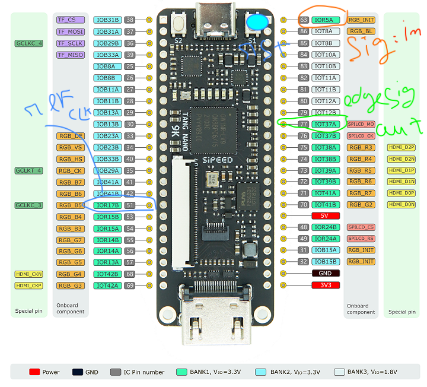
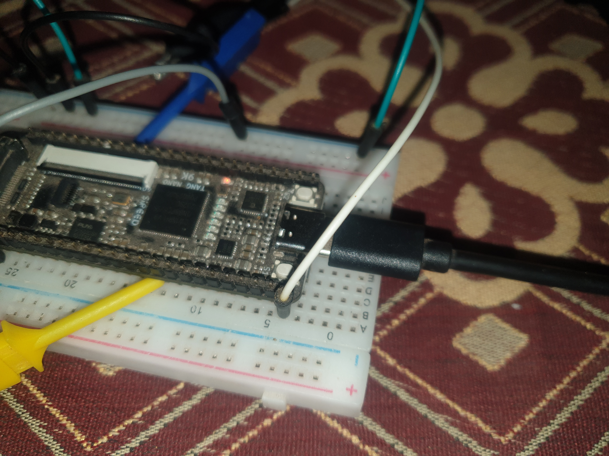
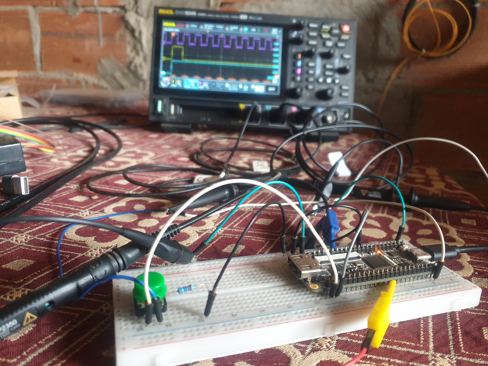

#### Disclaimer
This section lacks an explanation as it is part of an ongoing project. A detailed explanation or reference may be added later.

#### Wiring

### How To Run
- make upload_memory

- CH2 (the purple trace) represents your input, connected to the button to simulate changes in the signal.
- CH1 displays the output of the edge detector.
- CH3 shows the clock signal for reference